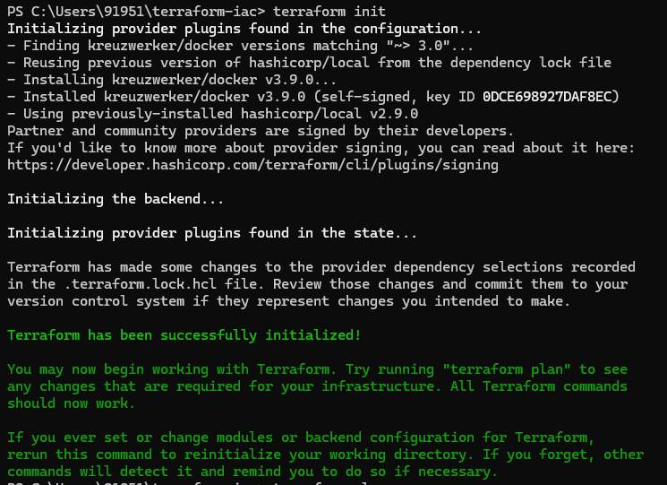
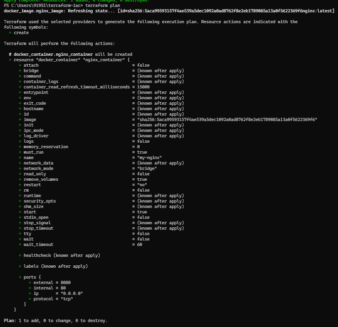
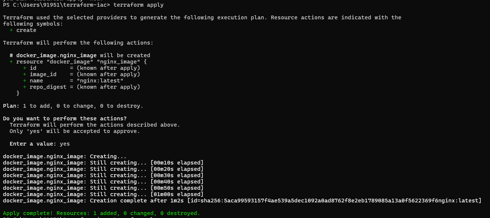
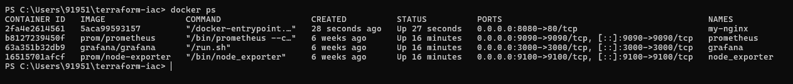
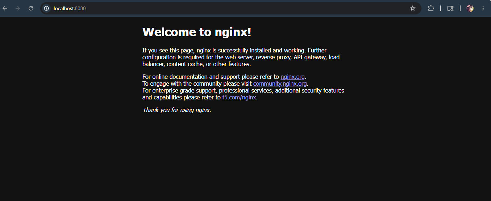

# Terraform Docker Infrastructure Automation

## Project Overview

This project demonstrates Infrastructure as Code (IaC) automation using Terraform and Docker. The infrastructure is provisioned declaratively using Terraform providers and resources to automate Docker image management, container provisioning, and networking configuration.

The project focuses on understanding core Terraform concepts such as:

* Providers
* Resources
* Variables
* Outputs
* Terraform State
* Dependency Handling
* Infrastructure Lifecycle Management
* Declarative Infrastructure Provisioning

---

# Tech Stack

* Terraform
* Docker
* NGINX

---

# Project Architecture

Terraform<br/>
↓<br/>
Docker Provider<br/>
↓<br/>
NGINX Docker Image<br/>
↓<br/>
Docker Container<br/>
↓<br/>
Port Mapping<br/>
↓<br/>
Browser Access

---

# Features

* Automated Docker image provisioning using Terraform
* Docker container lifecycle management
* Declarative infrastructure setup
* Port mapping configuration
* Terraform state management
* Infrastructure dependency handling
* Infrastructure reconciliation and idempotency

---

# Terraform Workflow Used

## Initialize Terraform

```bash
terraform init
```

## Review Infrastructure Plan

```bash
terraform plan
```

## Apply Infrastructure

```bash
terraform apply
```

## Destroy Infrastructure

```bash
terraform destroy
```

---

# Docker Container Configuration

The Terraform configuration provisions:

* NGINX Docker image
* Docker container named `my-nginx`
* Port mapping:

  * Internal Port: 80
  * External Port: 8080

Application accessible at:

```text
http://localhost:8080
```

---

# Screenshots

## Terraform Initialization



---

## Terraform Plan



---

## Terraform Apply



---

## Running Docker Container



---

## NGINX Running in Browser



---

# Learning Outcomes

Through this project, I gained hands-on experience with:

* Infrastructure as Code principles
* Terraform lifecycle management
* Docker infrastructure automation
* Declarative provisioning workflows
* Infrastructure state management
* Dependency graph handling
* Container networking concepts

---

# Repository Structure

```text
terraform-docker-iac/
│
├── main.tf
├── provider.tf
├── variables.tf
├── terraform.tfvars
├── outputs.tf
├── README.md
│
├── screenshots/
│   ├── terraform-init.png
│   ├── terraform-plan.png
│   ├── terraform-apply.png
│   ├── docker-ps.png
│   └── nginx-running.png
│
└── .gitignore
```

---

# Author

Sid
